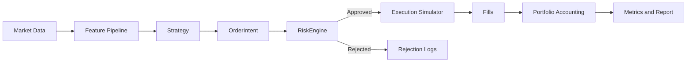

# execution-risk-research-stack

Institutional-grade, execution-aware, risk-first systematic trading research infrastructure.

## Overview

This repository is the flagship orchestrator for a deterministic, modular trading research stack.  
It separates signal generation from risk approval, execution simulation, portfolio accounting, and reporting so each layer can be validated independently.

## Repository Network

- Flagship (integration layer): `https://github.com/chopkinz/execution-risk-research-stack`
- Execution module (extractable): `https://github.com/chopkinz/execution-sim-lab`
- Risk module (extractable): `https://github.com/chopkinz/risk-engine-lab`

## System Flow



## Design Principles

- Deterministic runs through fixed seeds and config-driven parameters.
- Risk-first architecture: strategy cannot mutate portfolio or execute directly.
- Execution-aware fills with spread, slippage, latency, and transaction fees.
- No-lookahead feature pipeline behavior tested explicitly.
- Modular boundaries designed for future extraction into standalone repos.

## What This Repo Contains

| Area | Purpose |
| --- | --- |
| `src/core` | Shared contracts: types, config, clock, logging |
| `src/data` | Loaders, storage, validation, calendar, resampling |
| `src/features` | Leak-safe feature transformations |
| `src/strategy` | Signal intent generation only |
| `src/risk` | Risk approvals/rejections with reasons |
| `src/execution` | Fill simulation and cost/latency models |
| `src/portfolio` | Position state, cash/equity, PnL, exposure |
| `src/backtest` | Event loop, metrics, reporting, walkforward, sweep, Monte Carlo |
| `src/viz` | Artifact viewer dashboard |
| `scripts` | Operational entry points |
| `configs` | Reproducible run definitions |
| `tests` | Core correctness checks |
| `docs` | Architecture, assumptions, limitations, roadmap, split plan |

## Quickstart (3 Commands)

```bash
python -m venv .venv && source .venv/bin/activate
make install
make verify
```

`make verify` is the canonical validation command and runs:

- dependency install
- offline deterministic demo run
- pytest suite
- UI smoke check (`ui-check`)

## Run UI

```bash
make ui
```

This launches `ui/app.py` (Streamlit).  
The UI includes a **Run Demo** button that calls the demo pipeline in-process (no shell subprocess required).

## Additional Operations

```bash
make demo
make test
make ui-check
```

## Demo Artifacts

`scripts/demo.py` writes a deterministic offline run to `outputs/demo_run/`:

- `equity_curve.png`
- `drawdown.png`
- `risk_rejections.png`
- `report.md`
- `run.log`
- csv artifacts (`trades.csv`, `equity_curve.csv`, `risk_rejections.csv`, metrics)

### Screenshot References


## Configuration and Reproducibility

- Base configs live under `configs/` (for example `nas100_momentum.yaml`).
- Determinism is controlled by `seed` and explicit config values for strategy/risk/execution.
- Experiment scripts are designed to run from config with consistent run metadata.

## Testing

Run full suite:

```bash
python -m pytest -q
```

Core coverage includes:

- accounting correctness
- risk rejection logic
- no-lookahead safeguards
- execution cost application
- offline demo artifact generation

## Documentation Index

- Architecture: `docs/architecture.md`
- Assumptions: `docs/assumptions.md`
- Limitations: `docs/limitations.md`
- Roadmap: `docs/roadmap.md`
- Repo extraction plan: `docs/repo_split_plan.md`

## Loom Walkthrough Outline

Use this flow for a 3-5 minute hiring-manager demo:

1. Positioning: risk-first execution-aware infrastructure, not alpha marketing.
2. Architecture: walk through `Strategy -> Risk -> Execution -> Portfolio -> Metrics`.
3. Verification: run `make verify` and show pass.
4. Artifacts: open `outputs/demo_run` and explain report + risk rejects.
5. UI: run `make ui`, click **Run Demo**, confirm generated outputs.

## Repo Split and Module Extraction

This flagship already includes extraction-ready module folders:

- `execution-sim-lab/`
- `risk-engine-lab/`

See `docs/repo_split_plan.md` for step-by-step extraction and import migration guidance.

## Release Notes

- Current baseline tag: `v0.1.0`
- Flagship is the orchestration surface.
- Module repos can adopt independent semantic versioning post extraction hardening.
