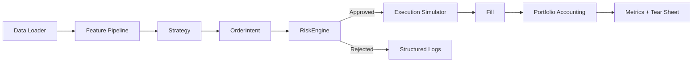

# Architecture

## Principles
- Deterministic execution with fixed seeds.
- Risk-first gate: strategy cannot mutate portfolio.
- Execution-aware fills: spread, slippage, latency, fees.
- Separation of concerns by module.
